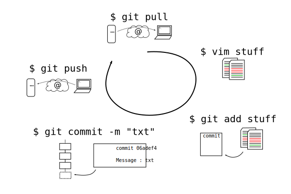

:data-transition-duration: 1000
:skip-help: true
:css: css/style.css

.. role:: contact
.. role:: definition
.. role:: note

----

:id: title

Git, Github et compagnie
========================

Mathieu Gaborit

----

Celui qui cause...
------------------

Mathieu Gaborit (aka. matael)

:contact:`@matael`
:contact:`mathieu@matael.org`
:contact:`blog.matael.org`

Etudiant à l'Université du Maine,

Co-fondateur du *HAUM* (Hackerspace au Mans)

Git-formaté

----

Pourquoi git ?
==============

Versionnement
-------------

Faire des versions permet de :

- marquer des étapes dans l'écriture d'un projet
- récupérer du travail effacé par mégarde
- revenir à un état antérieur du code pour l'améliorer
- garder une trace du processus de développement
- tester des implémentations sans corrompre le projet

----

Pourquoi git ?
==============

Gestionnaires de versions
-------------------------

- centralisés : Subversion (SVN), CVS, RCS (ancien),...
  Le serveur conserve toutes les sources
- distribués : Bazaar (bzr), Mercurial (hg), Darcs, Git, etc...
  Chacun dispose d'une copie complète du projet

Tous ceux ci sont des logiciels libres !

----

Pourquoi git ?
==============

Git
---

Plusieurs avantages :

- distribué
- libre
- largement utilisé dans le monde du logiciel libre
- versions régulières
- efficace :)

----

Pourquoi git ?
==============

Github & Cie.
-------------

Les geeks aiment aussi les réseaux sociaux... pour partager du code :)

Github, Gitorious, BitBucket et autres permettent :

- d'héberger des dépôts privés ou publics
- d'accèder à un bug tracker
- de *forker* des projets existants et d'y contribuer

Ces outils ajoutent une dimension sociale au code.

:definition:`forker`: cloner un projet pour poursuivre un développement parallèle au projet d'origine.

----

La base
=======

Initialiser/Cloner un dépôt
---------------------------

Création d'un dépôt à partir de 0
~~~~~~~~~~~~~~~~~~~~~~~~~~~~~~~~~

.. code:: bash

    $ git init [--bare] nom_du_repo

Crée un dossier ``nom_du_repo`` (avec un ``.git/`` dedans).
Avec ``--bare`` : crée un répertoire ``nom_du_repo.git``

:note:`Note: On ne peut pousser que vers les dépôts --bare.`

Clone d'un dépôt existant
~~~~~~~~~~~~~~~~~~~~~~~~~

.. code:: bash

    $ git clone URL nom_du_repo

Clone le dépôt distant dans ``nom_du_repo/``

----

La base
=======

Qu'est ce qu'un commit ?
------------------------

Un *commit* est un ensemble de modifications sur les fichiers du dépôt.

Un bon commit doit être **atomique** et correspondre à une **modification précise**.

Il doit aussi être accompagné d'un **message explicatif efficace**.

Un bon commit message
---------------------

Il doit :

- refléter les changements effectués (pas que les noms des fichiers)
- permettre à chacun de comprendre l'intérêt des modifications apportées

----

La base
=======

Connaitre l'état du dépôt
-------------------------

.. code:: bash

    $ git status

Différents statuts :

- *untracked* : le fichier n'est actuellement pas suivi (pas pris en compte) par git
- *modified* : le fichier a été modifié par rapport à la version en mémoire

2 listes disctinctes :

- modifications qui seront validées (*commitées*)
- modifications qui ne seront pas validées

----

La base
=======

Ajouter des fichiers au prochain commit
---------------------------------------

.. code:: bash

    $ git add fichier1 fichier2 repertoire/
    $ git add . # à éviter

----

La base
=======

Ecrire le commit
----------------

.. code:: bash

    $ git commit
    $ git commit -m "Message de commit"

Le premier ouvrira votre éditeur par défaut (variable ``$EDITOR``) pour écrire le message de commit.

Le second vous permet de spécifier le message dans la ligne de commande.

Modifier le dernier commit
--------------------------

.. code:: bash

    $ git commit --amend

Cette commande permet de modifier le dernier commit :

- soit pour ajouter des fichiers avec ``add`` puis ``commit --amend``
- soit pour modifier le message

----

La base
=======

Récupérer les modifications distantes
-------------------------------------

.. code:: bash

    $ git pull

Git essaiera de fusionner vos modifications avec celles distantes et vous avertira en cas de conflit.

Envoyer vos modifications
-------------------------

.. code:: bash

    $ git push

Git vous avertira si vos modifications ne sont pas *fast-forward*.

:definition:`fast-forward` : les modifications suivent bien l'ordre de l'arbre

----

La base
=======

Annuler des modifications
-------------------------

Avant un commit
~~~~~~~~~~~~~~~

.. code:: bash

    $ git checkout fichier

Annuler le dernier commit
-------------------------

**Attention, les modifications seront perdues**

.. code:: bash

    $ git revert HEAD

----

:id: workflow

La base
=======

Workflow standard
-----------------

----

:id: branchs

Un peu plus loin
================

Les branches
------------

Elle permettent :

- de tester des implémentations hors de la branche principale
- de découper le dépôt en sous-dépôts dédiés à des fonctionnalités précises

Elles peuvent être *locales* ou *partagées*.

**master** est la branche par défaut (pendant partagé : **origin/master**).

Créer une branche
~~~~~~~~~~~~~~~~~

.. code:: bash

    $ git branch branche

Changer de branche
~~~~~~~~~~~~~~~~~~

.. code:: bash

    $ git checkout branche

**Attention, il faut que le répertoire de travail soit "propre"**

----

Un peu plus loin
================

Pousser une branche
-------------------

.. code:: bash

    $ git checkout branche
    $ git push -u origin branche

Merger une branche dans master
------------------------------

.. code:: bash

    $ git checkout master
    $ git merge branche

Supprimer une branche locale/partagée
-------------------------------------

.. code:: bash

    $ git branch -d branche # local
    $ git push origin :branche # vous l'oublierez :)

----

:id: conflict

Un peu plus loin
================

Merge et Conflits
-----------------

Après un ``pull`` ou un ``merge`` il peut y avoir des conflits...

Il faut alors réparer les dégats :

.. code:: bash

    $ git mergetool
    $ git commit

Git affiche des choses du genre dans les fichiers ::

    <<<<<< HEAD
    [...]
    ========
    [...]
    <<<<<< de4db33f

----

Un peu plus loin
================

.gitignore
----------

Permet d'indiquer à git de ne pas suivre certains fichiers.

Un ``.gitignore`` pour un dépôt Python et LaTeX ::

    *.pyc
    *.aux
    *.log
    __pycache__/

Le .gitignore doit être commité pour être actif.

----

Un peu plus loin
================

Ajouts partiels
---------------

Il est possible de committer qu'une partie des fichiers. Pour cela :

.. code:: bash

    $ git add --patch fichier

Git vous demandera alors ce que vous souhaitez committer.
Vous pourrez répondre par :

- ``y`` : pour ajouter le *hunk* au commit
- ``n`` : pour ignorer le *hunk*
- ``s`` : pour que git essaye de le splitter encore
- ``q`` : pour quitter
- ``?`` : pour un peu d'aide

----

:id: thanks

Merci à tous !
==============
